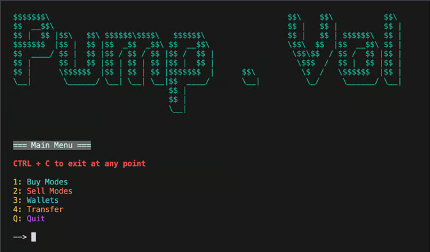

<h1  align="center"> Solana Market Maker Bot 👽 AIO Crypto Bot </h1>

Pump.vol is the best AIO-bot which includes Solana Volume Bot, Solana Bump Bot, Solana trading Bot
 

### Unlike other tools, pump.vol operates solely through its *private RPC⚡*, ensuring lightning-fast execution of trades.

## ✅ The bot is fully open soruce and you can use it for free!✅

### With a focus on simplicity and user-friendliness, pump.vol enables traders, whether experienced or new to the Solana world, to quickly and easily:

### - **💎 Volume Bot**: *creates natural trading activity for your token by allowing you to set SOL purchase ranges and delays between buys.*
### - **🎯 Snipe Bot**: *utilizes sub wallets for mass purchasing of existing tokens before Community Take Over (CTO) and monitors new tokens minted by specific wallets for quick acquisition.*
### - **💲 Create Token**: *flexible Token Bundler facilitates token launches on PUMP.FUN and Raydium, offering manual wallet allocation, dynamic SOL distribution, and sniper protection.*
### - **⚠️ Wallet Set**: *Each set includes a Master Wallet and multiple Sub Wallets with customizable settings for fees, priority fees, slippage, and other parameters. Manage balances by viewing balances, private keys, and performing low-fee fund and withdrawal operations.*
### - **⚙️ Settings**: *Update default configurations for each bot, including changing language, updating software, and viewing logs.*

# How to use!

0. Install Python (with paths) and libaries of requirements.txt
1. Download the repo as a ZIP
2. Go in your file explorer & extract the ZIP
3. Go in the extracted folder
4. Open start.bat
5. Now the tool will start! Enjoy!

### - **💰 Pump Strategies**: 
- **Sandwich Attack: Automatically places orders around large pending transactions to capitalize on induced price movements.**
- **Front-running: Detects and executes transactions before others to leverage anticipated price impacts.**
- **Back-running: Executes trades immediately after profitable transactions to benefit from subsequent market movements.**
- **Arbitrage: Identifies and exploits price discrepancies across different markets with simultaneous trades.**
- **Pump Coordination: Coordinates buying to artificially inflate asset prices, then sells at the peak for a profit.**

### - **Market-Making and Trading Bots:**

- **Swap and Bulk Swap Tools:** Users can now perform swaps or bulk swaps for tokens, crucial for executing market-making strategies.
- **Market-Making Bots:** Introduced bots designed to assist in market-making, ensuring liquidity and tighter spreads in trading activities.

### - **Token Management:**

- **Token Creation:** Now you can create standard Solana tokens or vanity tokens with customized attributes to suit your needs.
- **Token Burning:** Implemented a feature allowing users to burn tokens they no longer need, improving control over token supply.
- **Token Permission Renouncement:** Added the ability to renounce specific token permissions, enhancing security and promoting decentralization.
- **Token Cloning:** Simplify the replication of token attributes with a new one-click token cloning feature.

### - **Liquidity Management:**

- **Liquidity Pool Creation and Removal:** Now supports the creation and management of liquidity pools on Raydium or Orca platforms.
- **Liquidity Pool Burning:** Added the ability to burn or remove liquidity from pools, offering users comprehensive liquidity management tools.

